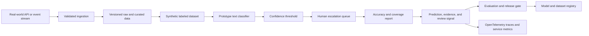

# Architecture

## Problem

Support operations need reproducible routing models that expose confidence and defer uncertain cases.

## System Flow

## Components

- **Synthetic labeled dataset**
- **Prototype text classifier**
- **Confidence threshold**
- **Human escalation queue**
- **Accuracy and coverage report**

## Recommended Production Stack

- FastAPI for prediction and feedback endpoints
- scikit-learn or LightGBM for production baselines
- Sentence Transformers for semantic fallback
- MLflow for experiments and model registry
- PostgreSQL for labels and human feedback
- Evidently-style drift and quality monitoring

## Hugging Face Tasks

- `text-classification`
- `zero-shot-classification`
- `sentence-similarity`
- `summarization`

## Model Architecture

The included baseline is a transparent token-prototype model. Training builds
per-label token weights and inverse-document-frequency retrieval weights from
the synthetic training split. The runtime returns a prediction, confidence,
review flag, and evidence documents. This baseline is intentionally small so
it can run in CI without paid compute.

For production, compare it with domain embeddings, gradient-boosted models, or
fine-tuned transformer models using the same held-out evaluation contract.

## Production Boundaries

- Validate and version all input schemas.
- Keep human review for low-confidence or high-impact decisions.
- Store prompts, traces, model versions, and dataset versions together.
- Do not treat synthetic evaluation performance as production evidence.
- Add authentication, authorization, encryption, and retention controls.

## Known Risks

Synthetic tickets do not represent every user population or language. Production training data needs consent and bias analysis.
